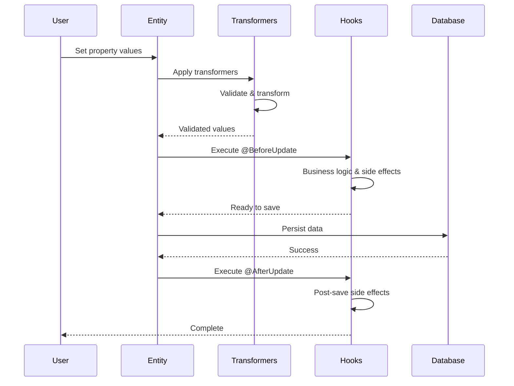

# Transformer Decorators Plan for Metal ORM

## Executive Summary

Design and implement a SOLID-compliant, type-safe transformer decorator system for Metal ORM that enables data validation and transformation on entity properties (e.g., alphanumeric validation, trimming, case conversion, etc.). Includes an **AutoTransform** mode that automatically corrects invalid data instead of throwing errors.

## Transformers vs Hooks: Complementary Features

### Key Differences

| Aspect | Transformers | Hooks |
|--------|-------------|-------|
| **Purpose** | Data validation and transformation | Side effects and business logic |
| **Scope** | Property-level | Entity-level |
| **Paradigm** | Declarative (decorators) | Imperative (methods) |
| **Composition** | Chainable, composable | Sequential execution |
| **Type Safety** | Strongly typed, compile-time checked | Runtime, flexible |
| **Use Cases** | Input sanitization, format validation, data normalization | Logging, caching, notifications, audit trails |
| **Error Handling** | Validation errors, auto-correction | Business logic errors, exceptions |
| **Execution Order** | Before hooks (validation first) | After transformers (side effects) |

### Why Both Are Needed

**Transformers excel at:**
- ✅ Validating and sanitizing individual property values
- ✅ Enforcing data integrity constraints
- ✅ Normalizing data formats (trimming, case conversion)
- ✅ Declarative, reusable validation rules
- ✅ Type-safe property-level transformations

**Hooks excel at:**
- ✅ Cross-property validation and business rules
- ✅ Side effects (logging, caching, notifications)
- ✅ Complex business logic that spans multiple properties
- ✅ External service calls (API requests, email sending)
- ✅ Audit trails and history tracking
- ✅ Conditional logic based on entity state

### Example: Using Both Together

```typescript
@Entity()
class User {
  @PrimaryKey({ type: 'INT' })
  id!: number;

  @Column({ type: 'VARCHAR', args: [100] })
  @Trim()
  @Lower()
  @Email()
  email!: string;

  @Column({ type: 'VARCHAR', args: [255] })
  @PasswordHash({ algorithm: 'bcrypt', saltRounds: 12 })
  password!: string;

  @Column({ type: 'DATETIME' })
  createdAt!: Date;

  @Column({ type: 'DATETIME' })
  updatedAt!: Date;

  // Hook: Side effect - send welcome email
  @BeforeInsert()
  async sendWelcomeEmail() {
    // This runs AFTER transformers have validated and transformed data
    await emailService.sendWelcome(this.email);
  }

  // Hook: Business logic - update timestamps
  @BeforeUpdate()
  updateTimestamps() {
    this.updatedAt = new Date();
  }

  // Hook: Cross-property validation
  @BeforeSave()
  validateBusinessRules() {
    // Transformers can't do this - requires access to multiple properties
    if (this.email.endsWith('@company.com') && !this.isEmployee) {
      throw new Error('Company emails require employee status');
    }
  }
}
```

### Execution Order

```
1. Transformers run (property-level validation/transformation)
   ├─ @Trim()
   ├─ @Lower()
   ├─ @Email()
   └─ @PasswordHash()

2. Hooks run (entity-level side effects)
   ├─ @BeforeInsert() / @BeforeUpdate()
   ├─ @BeforeSave()
   ├─ Database operation
   ├─ @AfterSave()
   └─ @AfterInsert() / @AfterUpdate()
```

### When to Use Transformers

Use transformers when you need to:
- Validate a single property's value
- Sanitize user input
- Normalize data formats
- Enforce data integrity constraints
- Apply automatic transformations (trimming, hashing, formatting)

### When to Use Hooks

Use hooks when you need to:
- Perform side effects (logging, caching, notifications)
- Implement cross-property validation
- Call external services
- Update related entities
- Track audit history
- Implement complex business logic

### Conclusion

**Transformers do NOT make hooks obsolete.** They serve complementary purposes:

- **Transformers** = Data integrity layer (what the data looks like)
- **Hooks** = Business logic layer (what happens with the data)

Both features work together to provide a complete solution for data validation, transformation, and business logic enforcement in Metal ORM.

## Architecture Overview

### Core Design Principles (SOLID)

1. **Single Responsibility Principle (SRP)**
   - Each transformer handles one specific transformation/validation concern
   - Separate interfaces for validation vs transformation
   - Metadata registration is distinct from execution

2. **Open/Closed Principle (OCP)**
   - New transformers can be added without modifying existing code
   - Transformer composition allows combining behaviors
   - Strategy pattern for transformer execution

3. **Liskov Substitution Principle (LSP)**
   - All transformers implement the same base interface
   - Transformers can be substituted without breaking behavior
   - Consistent error handling across all transformers

4. **Interface Segregation Principle (ISP)**
   - Small, focused interfaces (Validator, Transformer, Sanitizer)
   - Clients depend only on methods they use
   - Separate interfaces for read-only vs mutating operations

5. **Dependency Inversion Principle (DIP)**
   - High-level code depends on abstractions (interfaces), not concrete implementations
   - Transformer registry uses dependency injection
   - Materializer depends on transformer interface, not specific transformers

## System Architecture

### Core Interfaces

```typescript
// Base transformer interface
interface PropertyTransformer<TInput = unknown, TOutput = unknown> {
  readonly name: string;
  transform(value: TInput, context: TransformContext): TOutput;
}

// Validator interface (read-only, throws on failure)
interface PropertyValidator<T = unknown> {
  readonly name: string;
  validate(value: T, context: TransformContext): ValidationResult;
}

// Sanitizer interface (mutates, never throws)
interface PropertySanitizer<T = unknown> {
  readonly name: string;
  sanitize(value: T, context: TransformContext): T;
}

// Combined transformer that can validate and transform
interface CompositeTransformer<TInput = unknown, TOutput = unknown>
  extends PropertyTransformer<TInput, TOutput>,
    PropertyValidator<TInput> {}

// Transform context provides metadata about the transformation
interface TransformContext {
  entityName: string;
  propertyName: string;
  columnType: ColumnType;
  isUpdate: boolean;
  originalValue?: unknown;
  autoTransform: boolean; // Whether auto-correction is enabled
}

// Auto-transform result for validators that can fix data
interface AutoTransformResult<T = unknown> {
  success: boolean;
  correctedValue?: T;
  message?: string;
}

// Extended validator interface with auto-transform capability
interface AutoTransformableValidator<T = unknown> extends PropertyValidator<T> {
  /**
   * Attempts to automatically correct an invalid value.
   * Returns undefined if auto-correction is not possible.
   */
  autoTransform?(value: T, context: TransformContext): AutoTransformResult<T>;
}
```

### Transformer Metadata

```typescript
// Metadata stored during decoration phase
interface TransformerMetadata {
  propertyName: string;
  transformers: PropertyTransformer[];
  validators: PropertyValidator[];
  sanitizers: PropertySanitizer[];
  executionOrder: 'before-save' | 'after-load' | 'both';
}

// Extended decorator metadata bag
interface DecoratorMetadataBag {
  columns: Array<{ propertyName: string; column: ColumnDefLike }>;
  relations: Array<{ propertyName: string; relation: RelationMetadata }>;
  transformers: Array<{ propertyName: string; metadata: TransformerMetadata }>;
}

// Transformer configuration options
interface TransformerConfig {
  auto?: boolean; // Enable auto-transform mode (default: false)
  execute?: 'before-save' | 'after-load' | 'both'; // When to execute (default: 'both')
  stopOnFirstError?: boolean; // Stop validation on first error (default: false)
}
```

### Transformer Registry

```typescript
// Registry for managing transformers
class TransformerRegistry {
  private static instance: TransformerRegistry;
  private transformers = new Map<string, PropertyTransformer>();
  private validators = new Map<string, PropertyValidator>();
  private sanitizers = new Map<string, PropertySanitizer>();

  registerTransformer(transformer: PropertyTransformer): void;
  registerValidator(validator: PropertyValidator): void;
  registerSanitizer(sanitizer: PropertySanitizer): void;

  getTransformer(name: string): PropertyTransformer | undefined;
  getValidator(name: string): PropertyValidator | undefined;
  getSanitizer(name: string): PropertySanitizer | undefined;

  // Built-in transformers are registered automatically
  registerBuiltInTransformers(): void;
}
```

## Built-in Transformers

### String Transformers

1. **TrimTransformer**
   - Trims whitespace from both ends
   - Options: `trimStart`, `trimEnd`, `trimAll`
   - Auto-transform: Always applies trim

2. **CaseTransformer**
   - Converts case: `lower`, `upper`, `capitalize`, `title`
   - Auto-transform: Always applies case conversion

3. **AlphanumericValidator**
   - Validates that string contains only alphanumeric characters
   - Options: `allowSpaces`, `allowUnderscores`, `allowHyphens`
   - Auto-transform: Removes non-alphanumeric characters

4. **EmailValidator**
   - Validates email format using RFC 5322 regex
   - Options: `allowPlus`, `requireTLD`
   - Auto-transform: Attempts to fix common email issues (trim, lowercase)

5. **URLValidator**
   - Validates URL format
   - Options: `protocols`, `requireProtocol`
   - Auto-transform: Adds protocol if missing, normalizes

6. **LengthValidator**
   - Validates string length
   - Options: `min`, `max`, `exact`
   - Auto-transform: Truncates to max length, pads to min length

7. **PatternValidator**
   - Validates against custom regex pattern
   - Options: `pattern`, `flags`, `errorMessage`
   - Auto-transform: Replaces non-matching characters (if replacement provided)

8. **SlugTransformer**
   - Converts string to URL-friendly slug
   - Options: `separator`, `lowercase`, `removeStopWords`
   - Auto-transform: Always applies slug transformation

### Number Transformers

1. **RangeValidator**
   - Validates number is within range
   - Options: `min`, `max`, `inclusive`
   - Auto-transform: Clamps value to min/max range

2. **PrecisionTransformer**
   - Rounds to specified precision
   - Options: `decimalPlaces`, `roundingMode`
   - Auto-transform: Always rounds to specified precision

3. **PositiveValidator**
   - Validates number is positive (> 0)
   - Auto-transform: Converts negative to positive (abs)

4. **IntegerValidator**
   - Validates number is an integer
   - Auto-transform: Rounds to nearest integer

### Date Transformers

1. **DateRangeValidator**
   - Validates date is within range
   - Options: `min`, `max`

2. **FutureDateValidator**
   - Validates date is in the future

3. **PastDateValidator**
   - Validates date is in the past

### Network Transformers

1. **IPv4Validator**
   - Validates IPv4 address format
   - Options: `allowPrivate`, `allowReserved`, `allowLoopback`
   - Auto-transform: Normalizes format (removes leading zeros, trims)

2. **IPv6Validator**
   - Validates IPv6 address format
   - Options: `allowCompressed`, `allowMixed`, `allowIPv4Mapped`
   - Auto-transform: Normalizes to compressed form, lowercases

3. **CIDRValidator**
   - Validates CIDR notation (IPv4/IPv6 with prefix)
   - Options: `minPrefix`, `maxPrefix`, `ipVersion` ('4', '6', or 'both')
   - Auto-transform: Normalizes IP address, validates prefix range

### Security Transformers

1. **PasswordHashTransformer**
   - Hashes passwords using bcrypt/argon2
   - Options: `algorithm` ('bcrypt', 'argon2'), `saltRounds`, `memoryCost`, `timeCost`, `parallelism`
   - Auto-transform: Always hashes password (one-way transformation)
   - Note: This is a one-way transformation - cannot be reversed

2. **PasswordStrengthValidator**
   - Validates password strength
   - Options: `minLength`, `minLowercase`, `minUppercase`, `minNumbers`, `minSpecialChars`, `forbiddenPatterns`
   - Auto-transform: Cannot auto-transform (security requirement)
   - Returns strength score and feedback

3. **PasswordComplexityValidator**
   - Validates password meets complexity requirements
   - Options: `requireMixedCase`, `requireNumbers`, `requireSpecialChars`, `forbidCommonPasswords`, `forbidUserInfo`
   - Auto-transform: Cannot auto-transform (security requirement)
   - Checks against common password lists

### Contact Transformers

1. **PhoneValidator**
   - Validates phone number format
   - Options: `countryCode`, `allowInternational`, `strictMode`, `allowExtensions`
   - Auto-transform: Normalizes format (removes spaces, dashes, parentheses)
   - Supports E.164 format

2. **PhoneCountryValidator**
   - Validates phone number for specific country
   - Options: `country` (ISO 3166-1 alpha-2), `allowMobile`, `allowLandline`, `allowTollFree`
   - Auto-transform: Adds country code if missing, normalizes format
   - Country-specific validation rules

### Financial Transformers

1. **CreditCardValidator**
   - Validates credit card number using Luhn algorithm
   - Options: `cardTypes` ('visa', 'mastercard', 'amex', 'discover', etc.), `requireCvv`, `requireExpiry`
   - Auto-transform: Removes spaces and dashes, validates format
   - Detects card type from number

2. **CurrencyFormatter**
   - Formats numbers as currency
   - Options: `currency` (ISO 4217 code), `locale`, `decimalPlaces`, `symbolPosition` ('before', 'after')
   - Auto-transform: Always formats as currency
   - Handles currency symbols and decimal places

3. **CurrencyValidator**
   - Validates currency amount
   - Options: `min`, `max`, `allowNegative`, `decimalPlaces`
   - Auto-transform: Rounds to specified decimal places, clamps to range
   - Validates against currency-specific rules

### Date/Time Transformers

1. **DateTimeParser**
   - Parses date/time strings to Date objects
   - Options: `format`, `locale`, `timezone`, `strictMode`
   - Auto-transform: Always parses to Date object
   - Supports multiple date formats

2. **DateTimeFormatter**
   - Formats Date objects to strings
   - Options: `format`, `locale`, `timezone`, `customFormat`
   - Auto-transform: Always formats to string
   - Supports ICU date format patterns

3. **TimezoneTransformer**
   - Converts dates between timezones
   - Options: `fromTimezone`, `toTimezone`, `preserveLocalTime`
   - Auto-transform: Always converts timezone
   - Handles DST transitions

4. **DateRangeValidator**
   - Validates date is within range
   - Options: `min`, `max`, `inclusive`

5. **FutureDateValidator**
   - Validates date is in the future
   - Options: `allowToday`, `timezone`

6. **PastDateValidator**
   - Validates date is in the past
   - Options: `allowToday`, `timezone`

### Data Structure Transformers

1. **JsonValidator**
   - Validates JSON structure
   - Options: `schema` (JSON Schema), `strictMode`, `allowAdditionalProperties`
   - Auto-transform: Attempts to fix common JSON issues (trailing commas, quotes)
   - Validates against JSON Schema

2. **JsonSchemaValidator**
   - Validates data against JSON Schema
   - Options: `schema`, `validateFormats`, `requiredOnly`
   - Auto-transform: Coerces types if possible (string to number, etc.)
   - Supports JSON Schema Draft 7

3. **ArrayValidator**
   - Validates array structure
   - Options: `minLength`, `maxLength`, `itemType`, `uniqueItems`, `itemValidator`
   - Auto-transform: Removes duplicates, filters invalid items
   - Validates each item against itemValidator

4. **ObjectValidator**
   - Validates object structure
   - Options: `requiredKeys`, `optionalKeys`, `keyValidators`, `allowExtraKeys`
   - Auto-transform: Removes extra keys, adds default values
   - Validates each key-value pair

### Generic Transformers

1. **EnumValidator**
   - Validates value is in allowed enum values
   - Options: `values`, `caseSensitive`
   - Auto-transform: Converts to nearest valid value (case-insensitive match)

2. **DefaultTransformer**
   - Provides default value if undefined/null
   - Options: `defaultValue`, `applyOnUndefined`, `applyOnNull`
   - Auto-transform: Always applies default when condition met

3. **NullIfEmptyTransformer**
   - Converts empty string to null
   - Options: `trimFirst`
   - Auto-transform: Always converts empty to null

4. **CustomTransformer**
   - Allows custom transformation function
   - Options: `transformFn`, `validateFn`, `autoTransformFn`
   - Auto-transform: Uses provided autoTransformFn if available

## AutoTransform Mode

### Overview

AutoTransform mode enables automatic data correction instead of throwing validation errors. When enabled, validators attempt to fix invalid data before proceeding. This is particularly useful for:

- Data import/migration scenarios
- User input sanitization
- Legacy data cleanup
- Graceful degradation in production

### How It Works

1. **Validation Phase**: Validator checks if value is valid
2. **Auto-Correction**: If invalid and auto-transform is enabled, attempt to fix
3. **Retry**: Validate the corrected value
4. **Fallback**: If correction fails, throw error (or return original based on config)

### Configuration

```typescript
// Enable auto-transform globally
TransformerRegistry.getInstance().setAutoTransform(true);

// Enable auto-transform per decorator
@Alphanumeric({ auto: true })
username!: string;

// Enable auto-transform per entity
@Entity({ autoTransform: true })
class User { ... }

// Enable auto-transform per operation
session.save(user, { autoTransform: true });
```

### AutoTransform Behavior by Transformer

| Transformer | Auto-Correction Strategy |
|-------------|-------------------------|
| `@Trim()` | Always trims (no validation needed) |
| `@Lower()` | Always converts to lowercase |
| `@Alphanumeric()` | Removes non-alphanumeric characters |
| `@Email()` | Trims, lowercases, removes extra dots |
| `@URL()` | Adds protocol, normalizes path |
| `@Length()` | Truncates to max, pads to min |
| `@Range()` | Clamps to min/max |
| `@Positive()` | Converts to absolute value |
| `@Integer()` | Rounds to nearest integer |
| `@Enum()` | Case-insensitive match to valid value |
| `@Default()` | Applies default when undefined/null |
| `@NullIfEmpty()` | Converts empty string to null |
| `@IPv4()` | Normalizes format, removes leading zeros |
| `@IPv6()` | Normalizes to compressed form, lowercases |
| `@CIDR()` | Normalizes IP, validates prefix range |
| `@PasswordHash()` | Always hashes (one-way, no auto-correction) |
| `@PasswordStrength()` | No auto-correction (security requirement) |
| `@PasswordComplexity()` | No auto-correction (security requirement) |
| `@Phone()` | Removes spaces, dashes, parentheses |
| `@PhoneCountry()` | Adds country code, normalizes format |
| `@CreditCard()` | Removes spaces/dashes, validates Luhn |
| `@Currency()` | Always formats with symbol and decimals |
| `@DateTimeParse()` | Always parses to Date object |
| `@DateTimeFormat()` | Always formats to string |
| `@Timezone()` | Always converts timezone |
| `@Json()` | Fixes common JSON issues |
| `@JsonSchema()` | Coerces types if possible |
| `@Array()` | Removes duplicates, filters invalid items |
| `@Object()` | Removes extra keys, adds defaults |

### AutoTransform Result Tracking

```typescript
interface TransformResult {
  value: unknown;
  wasTransformed: boolean;
  autoCorrections: AutoCorrection[];
}

interface AutoCorrection {
  transformerName: string;
  originalValue: unknown;
  correctedValue: unknown;
  message: string;
}
```

### Example: AutoTransform in Action

```typescript
@Entity({ autoTransform: true })
class User {
  @Column({ type: 'VARCHAR', args: [100] })
  @Trim()
  @Alphanumeric({ auto: true })
  username!: string;

  @Column({ type: 'VARCHAR', args: [255] })
  @Email({ auto: true })
  email!: string;

  @Column({ type: 'INT' })
  @Range({ min: 18, max: 120, auto: true })
  age!: number;
}

// Input with invalid data
const user = new User();
user.username = "  John_Doe123!  "; // Has spaces and special chars
user.email = "  JOHN@EXAMPLE.COM  "; // Has spaces and uppercase
user.age = 150; // Out of range

// After auto-transform:
// username: "John_Doe123" (trimmed, special chars removed)
// email: "john@example.com" (trimmed, lowercased)
// age: 120 (clamped to max)
```

### Entity-Level AutoTransform Configuration

```typescript
// Enable auto-transform for entire entity
@Entity({ autoTransform: true })
class User {
  @Column({ type: 'VARCHAR', args: [100] })
  @Alphanumeric() // Auto-transform enabled by entity config
  username!: string;

  @Column({ type: 'VARCHAR', args: [255] })
  @Email() // Auto-transform enabled by entity config
  email!: string;
}

// Override auto-transform per property
@Entity({ autoTransform: true })
class User {
  @Column({ type: 'VARCHAR', args: [100] })
  @Alphanumeric({ auto: false }) // Disable auto-transform for this property
  username!: string;

  @Column({ type: 'VARCHAR', args: [255] })
  @Email() // Uses entity-level auto-transform (true)
  email!: string;
}
```

## Decorator API

### Basic Usage

```typescript
@Entity()
class User {
  @PrimaryKey({ type: 'INT' })
  id!: number;

  @Column({ type: 'VARCHAR', args: [100] })
  @Trim()
  @Alphanumeric({ allowUnderscores: true })
  username!: string;

  @Column({ type: 'VARCHAR', args: [255] })
  @Email()
  email!: string;

  @Column({ type: 'VARCHAR', args: [50] })
  @Length({ min: 8, max: 50 })
  password!: string;

  @Column({ type: 'VARCHAR', args: [100] })
  @Slug()
  slug!: string;

  @Column({ type: 'INT' })
  @Range({ min: 18, max: 120 })
  age!: number;
}
```

### Composition

```typescript
// Multiple transformers can be chained
@Column({ type: 'VARCHAR', args: [100] })
@Trim()
@Lower()
@Length({ min: 3, max: 50 })
@Alphanumeric()
username!: string;

// Transformers execute in order (bottom to top)
// 1. Alphanumeric validation
// 2. Length validation
// 3. Lower case conversion
// 4. Trim whitespace
```

### Custom Transformers

```typescript
// Define a custom transformer
const customTransformer: PropertyTransformer<string, string> = {
  name: 'custom-prefix',
  transform: (value, context) => `PREFIX_${value}`
};

// Register it
TransformerRegistry.getInstance().registerTransformer(customTransformer);

// Use it
@Column({ type: 'VARCHAR', args: [100] })
@Transform('custom-prefix')
code!: string;
```

### Execution Control

```typescript
// Execute only before save (write operations)
@Column({ type: 'VARCHAR', args: [100] })
@Trim({ execute: 'before-save' })
name!: string;

// Execute only after load (read operations)
@Column({ type: 'VARCHAR', args: [100] })
@Decrypt({ execute: 'after-load' })
encryptedData!: string;

// Execute both ways (default)
@Column({ type: 'VARCHAR', args: [100] })
@Trim()
name!: string;
```

## Usage Examples

### Security Transformers

```typescript
@Entity()
class User {
  @PrimaryKey({ type: 'INT' })
  id!: number;

  @Column({ type: 'VARCHAR', args: [255] })
  @PasswordHash({ algorithm: 'bcrypt', saltRounds: 12 })
  password!: string;

  @Column({ type: 'VARCHAR', args: [255] })
  @Email()
  email!: string;
}

// Password is automatically hashed before saving
const user = new User();
user.email = 'user@example.com';
user.password = 'plainTextPassword123';
await session.save(user);
// password is now: $2b$12$... (bcrypt hash)
```

```typescript
// Password strength validation
@Entity()
class User {
  @Column({ type: 'VARCHAR', args: [255] })
  @PasswordStrength({
    minLength: 8,
    minLowercase: 1,
    minUppercase: 1,
    minNumbers: 1,
    minSpecialChars: 1
  })
  password!: string;
}

// Password complexity validation
@Entity()
class User {
  @Column({ type: 'VARCHAR', args: [255] })
  @PasswordComplexity({
    requireMixedCase: true,
    requireNumbers: true,
    requireSpecialChars: true,
    forbidCommonPasswords: true,
    forbidUserInfo: true
  })
  password!: string;
}
```

### Contact Transformers

```typescript
@Entity()
class Contact {
  @PrimaryKey({ type: 'INT' })
  id!: number;

  @Column({ type: 'VARCHAR', args: [20] })
  @Phone({ countryCode: 'US', allowInternational: true })
  phone!: string;

  @Column({ type: 'VARCHAR', args: [20] })
  @PhoneCountry({ country: 'BR', allowMobile: true, allowLandline: true })
  brazilianPhone!: string;
}

// Phone numbers are normalized
const contact = new Contact();
contact.phone = '(555) 123-4567'; // Normalized to: +15551234567
contact.brazilianPhone = '(11) 98765-4321'; // Normalized to: +5511987654321
```

### Financial Transformers

```typescript
@Entity()
class Payment {
  @PrimaryKey({ type: 'INT' })
  id!: number;

  @Column({ type: 'VARCHAR', args: [19] })
  @CreditCard({ cardTypes: ['visa', 'mastercard'], requireCvv: true })
  cardNumber!: string;

  @Column({ type: 'DECIMAL', args: [10, 2] })
  @Currency({ currency: 'USD', locale: 'en-US', decimalPlaces: 2 })
  amount!: number;

  @Column({ type: 'DECIMAL', args: [10, 2] })
  @CurrencyValidator({ min: 0, max: 1000000, allowNegative: false })
  price!: number;
}

// Credit card validation with Luhn algorithm
const payment = new Payment();
payment.cardNumber = '4111-1111-1111-1111'; // Valid Visa
payment.amount = 1234.56; // Formatted as: $1,234.56
```

### Date/Time Transformers

```typescript
@Entity()
class Event {
  @PrimaryKey({ type: 'INT' })
  id!: number;

  @Column({ type: 'DATETIME' })
  @DateTimeParse({ format: 'yyyy-MM-dd HH:mm:ss', timezone: 'UTC' })
  startDate!: Date;

  @Column({ type: 'DATETIME' })
  @DateTimeFormat({ format: 'yyyy-MM-dd HH:mm:ss', timezone: 'America/Sao_Paulo' })
  displayDate!: Date;

  @Column({ type: 'DATETIME' })
  @Timezone({ fromTimezone: 'UTC', toTimezone: 'America/Sao_Paulo' })
  localDate!: Date;

  @Column({ type: 'DATETIME' })
  @FutureDate({ allowToday: false })
  eventDate!: Date;

  @Column({ type: 'DATETIME' })
  @PastDate({ allowToday: true })
  birthDate!: Date;
}
```

### Data Structure Transformers

```typescript
@Entity()
class Configuration {
  @PrimaryKey({ type: 'INT' })
  id!: number;

  @Column({ type: 'TEXT' })
  @Json({ strictMode: true })
  settings!: string;

  @Column({ type: 'TEXT' })
  @JsonSchema({
    schema: {
      type: 'object',
      properties: {
        theme: { type: 'string', enum: ['light', 'dark'] },
        notifications: { type: 'boolean' }
      },
      required: ['theme']
    }
  })
  preferences!: string;

  @Column({ type: 'TEXT' })
  @Array({ minLength: 1, maxLength: 10, uniqueItems: true })
  tags!: string[];

  @Column({ type: 'TEXT' })
  @Object({
    requiredKeys: ['name', 'email'],
    optionalKeys: ['phone'],
    allowExtraKeys: false
  })
  profile!: Record<string, unknown>;
}
```

### Combined Example

```typescript
@Entity({ autoTransform: true })
class UserProfile {
  @PrimaryKey({ type: 'INT' })
  id!: number;

  @Column({ type: 'VARCHAR', args: [100] })
  @Trim()
  @Lower()
  @Email()
  email!: string;

  @Column({ type: 'VARCHAR', args: [50] })
  @Alphanumeric({ allowUnderscores: true })
  username!: string;

  @Column({ type: 'VARCHAR', args: [255] })
  @PasswordHash({ algorithm: 'bcrypt', saltRounds: 12 })
  password!: string;

  @Column({ type: 'VARCHAR', args: [20] })
  @Phone({ countryCode: 'US' })
  phone!: string;

  @Column({ type: 'DATETIME' })
  @DateTimeParse({ format: 'yyyy-MM-dd', timezone: 'UTC' })
  @PastDate({ allowToday: true })
  birthDate!: Date;

  @Column({ type: 'TEXT' })
  @JsonSchema({
    schema: {
      type: 'object',
      properties: {
        theme: { type: 'string' },
        language: { type: 'string' }
      }
    }
  })
  preferences!: string;
}
```

### Transformers and Hooks Integration

```typescript
@Entity()
class Order {
  @PrimaryKey({ type: 'INT' })
  id!: number;

  @Column({ type: 'DECIMAL', args: [10, 2] })
  @Range({ min: 0, max: 1000000 })
  @Currency({ currency: 'USD', locale: 'en-US' })
  total!: number;

  @Column({ type: 'VARCHAR', args: [50] })
  @Enum({ values: ['pending', 'processing', 'shipped', 'delivered', 'cancelled'] })
  status!: string;

  @Column({ type: 'DATETIME' })
  createdAt!: Date;

  @Column({ type: 'DATETIME' })
  updatedAt!: Date;

  // Hook: Business logic - validate status transitions
  @BeforeUpdate()
  validateStatusTransition() {
    // Transformers validated the status is a valid enum value
    // Now hooks enforce business rules about status changes
    const validTransitions = {
      pending: ['processing', 'cancelled'],
      processing: ['shipped', 'cancelled'],
      shipped: ['delivered'],
      delivered: [],
      cancelled: []
    };

    const originalStatus = this.getOriginalValue('status');
    const allowed = validTransitions[originalStatus as keyof typeof validTransitions] || [];
    
    if (!allowed.includes(this.status)) {
      throw new Error(`Cannot transition from ${originalStatus} to ${this.status}`);
    }
  }

  // Hook: Side effect - update timestamp
  @BeforeUpdate()
  updateTimestamps() {
    this.updatedAt = new Date();
  }

  // Hook: Side effect - send notification
  @AfterUpdate()
  async sendStatusNotification() {
    if (this.status !== this.getOriginalValue('status')) {
      await notificationService.sendOrderStatusUpdate(this.id, this.status);
    }
  }
}
```

### Execution Flow Diagram



## Implementation Plan

### Phase 1: Core Infrastructure

1. **Create transformer types module** (`src/transformers/types.ts`)
   - Define all interfaces (PropertyTransformer, PropertyValidator, PropertySanitizer)
   - Define `TransformContext` with `autoTransform` flag
   - Define `ValidationResult`, `AutoTransformResult`, `AutoCorrection`
   - Define `AutoTransformableValidator` interface
   - Export type guards

2. **Create transformer registry** (`src/transformers/registry.ts`)
   - Implement singleton pattern
   - Implement registration methods (transformers, validators, sanitizers)
   - Implement lookup methods
   - Add built-in transformer registration
   - Add global auto-transform configuration

3. **Extend decorator metadata** (`src/decorators/decorator-metadata.ts`)
   - Add `transformers` array to `DecoratorMetadataBag`
   - Add `TransformerMetadata` interface with `auto` flag
   - Update `getOrCreateMetadataBag` to initialize transformers

4. **Create transformer decorator factory** (`src/decorators/transformer-decorator.ts`)
   - Implement `@Transform()` decorator
   - Implement `@Validate()` decorator
   - Implement `@Sanitize()` decorator
   - Handle execution order options
   - Handle auto-transform configuration

### Phase 2: Built-in Transformers

5. **Create string transformers** (`src/transformers/string-transformers.ts`)
    - `TrimTransformer`
    - `CaseTransformer`
    - `AlphanumericValidator`
    - `EmailValidator`
    - `URLValidator`
    - `LengthValidator`
    - `PatternValidator`
    - `SlugTransformer`

6. **Create number transformers** (`src/transformers/number-transformers.ts`)
    - `RangeValidator`
    - `PrecisionTransformer`
    - `PositiveValidator`
    - `IntegerValidator`

7. **Create date/time transformers** (`src/transformers/datetime-transformers.ts`)
    - `DateTimeParser`
    - `DateTimeFormatter`
    - `TimezoneTransformer`
    - `DateRangeValidator`
    - `FutureDateValidator`
    - `PastDateValidator`

8. **Create security transformers** (`src/transformers/security-transformers.ts`)
    - `PasswordHashTransformer`
    - `PasswordStrengthValidator`
    - `PasswordComplexityValidator`

9. **Create contact transformers** (`src/transformers/contact-transformers.ts`)
    - `PhoneValidator`
    - `PhoneCountryValidator`

10. **Create financial transformers** (`src/transformers/financial-transformers.ts`)
    - `CreditCardValidator`
    - `CurrencyFormatter`
    - `CurrencyValidator`

11. **Create network transformers** (`src/transformers/network-transformers.ts`)
    - `IPv4Validator`
    - `IPv6Validator`
    - `CIDRValidator`

12. **Create data structure transformers** (`src/transformers/data-structure-transformers.ts`)
    - `JsonValidator`
    - `JsonSchemaValidator`
    - `ArrayValidator`
    - `ObjectValidator`

13. **Create generic transformers** (`src/transformers/generic-transformers.ts`)
    - `EnumValidator`
    - `DefaultTransformer`
    - `NullIfEmptyTransformer`
    - `CustomTransformer`

### Phase 3: Integration

9. **Update entity decorator** (`src/decorators/entity.ts`)
   - Process transformer metadata from bag
   - Register transformers with entity metadata
   - Maintain execution order

10. **Update entity materializer** (`src/orm/entity-materializer.ts`)
    - Apply transformers after loading data
    - Handle validation errors
    - Support transformer composition

11. **Create transformer executor** (`src/transformers/executor.ts`)
    - Execute transformers in order
    - Handle validation failures
    - Collect transformation results
    - Provide detailed error messages

12. **Update entity metadata** (`src/orm/entity-metadata.ts`)
    - Add `transformers` to `EntityMetadata`
    - Add transformer lookup methods
    - Support transformer inheritance

### Phase 4: Convenience Decorators

13. **Create convenience decorators** (`src/decorators/transformers/`)
    - **String**: `@Trim()`, `@Lower()`, `@Upper()`, `@Capitalize()`, `@Alphanumeric()`, `@Email()`, `@URL()`, `@Length()`, `@Pattern()`, `@Slug()`
    - **Number**: `@Range()`, `@Positive()`, `@Negative()`, `@Integer()`, `@Min()`, `@Max()`, `@Precision()`
    - **Date/Time**: `@DateTimeParse()`, `@DateTimeFormat()`, `@Timezone()`, `@FutureDate()`, `@PastDate()`, `@DateRange()`
    - **Security**: `@PasswordHash()`, `@PasswordStrength()`, `@PasswordComplexity()`
    - **Contact**: `@Phone()`, `@PhoneCountry()`
    - **Financial**: `@CreditCard()`, `@Currency()`, `@CurrencyValidator()`
    - **Network**: `@IPv4()`, `@IPv6()`, `@CIDR()`
    - **Data Structure**: `@Json()`, `@JsonSchema()`, `@Array()`, `@Object()`
    - **Generic**: `@Enum()`, `@Default()`, `@NullIfEmpty()`, `@Required()`, `@Transform()`, `@Validate()`, `@Sanitize()`

14. **Export from decorators index** (`src/decorators/index.ts`)
    - Export all convenience decorators
    - Export transformer types
    - Export registry for custom transformers

### Phase 5: Testing

15. **Create transformer tests** (`tests/transformers/`)
    - Unit tests for each transformer
    - Integration tests for composition
    - Type safety tests
    - Error handling tests

16. **Create decorator tests** (`tests/decorators/transformers.test.ts`)
    - Test decorator registration
    - Test metadata storage
    - Test execution order
    - Test error scenarios

17. **Create integration tests** (`tests/e2e/transformers.test.ts`)
    - Test with real entities
    - Test with database operations
    - Test with relations
    - Test with materialization

18. **Create auto-transform tests** (`tests/transformers/auto-transform.test.ts`)
    - Test auto-correction for each validator
    - Test auto-transform with composition
    - Test auto-transform error handling
    - Test auto-transform result tracking
    - Test entity-level vs property-level auto-transform

## Type Safety Strategy

### Avoiding `any` Types

1. **Generic Constraints**
   ```typescript
   interface PropertyTransformer<TInput = unknown, TOutput = TInput> {
     transform(value: TInput, context: TransformContext): TOutput;
   }
   ```

2. **Type Guards**
   ```typescript
   function isPropertyTransformer(obj: unknown): obj is PropertyTransformer {
     return typeof obj === 'object' &&
            obj !== null &&
            'name' in obj &&
            'transform' in obj &&
            typeof (obj as PropertyTransformer).transform === 'function';
   }
   ```

3. **Conditional Types**
   ```typescript
   type TransformerResult<T, TTransformers extends PropertyTransformer[]> =
     TTransformers extends [infer First, ...infer Rest]
       ? First extends PropertyTransformer<infer In, infer Out>
         ? TransformerResult<Out, Rest>
         : never
       : T;
   ```

4. **Overloaded Decorator Functions**
   ```typescript
   function Trim(): PropertyDecorator;
   function Trim(options: TrimOptions): PropertyDecorator;
   function Trim(options?: TrimOptions): PropertyDecorator {
     // Implementation
   }
   ```

5. **Strict Type Checking**
   ```typescript
   // tsconfig.json
   {
     "compilerOptions": {
       "strict": true,
       "noImplicitAny": true,
       "strictNullChecks": true,
       "strictFunctionTypes": true,
       "strictBindCallApply": true,
       "strictPropertyInitialization": true,
       "noImplicitThis": true,
       "alwaysStrict": true
     }
   }
   ```

## Error Handling

### Validation Result

```typescript
interface ValidationResult {
  isValid: boolean;
  errors: ValidationError[];
  autoCorrections?: AutoCorrection[];
}

interface ValidationError {
  transformerName: string;
  message: string;
  value: unknown;
  path: string;
  wasAutoCorrected?: boolean;
}

interface AutoCorrection {
  transformerName: string;
  originalValue: unknown;
  correctedValue: unknown;
  message: string;
}
```

### Error Types

```typescript
class TransformerError extends Error {
  constructor(
    public readonly transformerName: string,
    public readonly propertyName: string,
    message: string
  ) {
    super(`[${transformerName}] on ${propertyName}: ${message}`);
    this.name = 'TransformerError';
  }
}

class ValidationError extends TransformerError {
  constructor(
    transformerName: string,
    propertyName: string,
    public readonly value: unknown,
    message: string,
    public readonly autoCorrection?: AutoCorrection
  ) {
    super(transformerName, propertyName, message);
    this.name = 'ValidationError';
  }
}

class AutoTransformError extends TransformerError {
  constructor(
    transformerName: string,
    propertyName: string,
    public readonly originalValue: unknown,
    message: string
  ) {
    super(transformerName, propertyName, message);
    this.name = 'AutoTransformError';
  }
}
```

### Error Handling Strategy

1. **Validators throw on failure** (fail-fast) - unless auto-transform is enabled
2. **Transformers never throw** (best-effort)
3. **Sanitizers never throw** (always return valid value)
4. **Auto-transform mode**: Attempt correction before throwing
5. **Collect all validation errors** before throwing (unless stopOnFirstError)
6. **Provide detailed error context** for debugging
7. **Track auto-corrections** for audit/logging purposes

### AutoTransform Error Handling Flow

```typescript
function executeValidator<T>(
  validator: AutoTransformableValidator<T>,
  value: T,
  context: TransformContext
): T {
  // 1. Validate
  const result = validator.validate(value, context);
  
  if (result.isValid) {
    return value;
  }
  
  // 2. Check if auto-transform is enabled
  if (!context.autoTransform || !validator.autoTransform) {
    throw new ValidationError(
      validator.name,
      context.propertyName,
      value,
      result.errors[0].message
    );
  }
  
  // 3. Attempt auto-correction
  const autoResult = validator.autoTransform(value, context);
  
  if (!autoResult.success || autoResult.correctedValue === undefined) {
    throw new AutoTransformError(
      validator.name,
      context.propertyName,
      value,
      `Auto-transform failed: ${result.errors[0].message}`
    );
  }
  
  // 4. Validate the corrected value
  const correctedResult = validator.validate(autoResult.correctedValue, context);
  
  if (!correctedResult.isValid) {
    throw new AutoTransformError(
      validator.name,
      context.propertyName,
      value,
      `Auto-transform produced invalid value: ${correctedResult.errors[0].message}`
    );
  }
  
  // 5. Return corrected value
  return autoResult.correctedValue;
}
```

## Performance Considerations

1. **Lazy Transformer Registration**
   - Transformers registered on first use
   - Built-in transformers pre-registered

2. **Transformer Caching**
   - Cache transformer instances per property
   - Reuse transformer instances across entities

3. **Execution Optimization**
   - Skip transformers if value is unchanged
   - Short-circuit on validation failure
   - Batch transformations where possible

4. **Metadata Optimization**
   - Store transformer metadata efficiently
   - Use weak references where appropriate

## Documentation

### API Documentation

1. **Transformer Interface Reference**
   - All interfaces documented with JSDoc
   - Examples for each transformer
   - Type parameter documentation

2. **Decorator Reference**
   - All decorators documented
   - Usage examples
   - Options reference

3. **Custom Transformer Guide**
   - How to create custom transformers
   - How to register them
   - Best practices

### Examples

1. **Basic Usage Examples**
   - Simple entity with transformers
   - Common validation patterns

2. **Advanced Examples**
   - Custom transformers
   - Transformer composition
   - Error handling

3. **Integration Examples**
   - With relations
   - With materialization
   - With database operations

## Migration Path

### Backward Compatibility

1. **No Breaking Changes**
   - Existing code continues to work
   - Transformers are opt-in
   - Default behavior unchanged

2. **Gradual Adoption**
   - Add transformers to new entities
   - Gradually add to existing entities
   - Mix with and without transformers

3. **Deprecation Policy**
   - No deprecations in initial release
   - Future deprecations announced in advance
   - Migration guides provided

## Success Criteria

1. **Type Safety**
   - Zero `any` types in transformer code
   - Full TypeScript strict mode compliance
   - No type errors in tests

2. **SOLID Compliance**
   - Each transformer has single responsibility
   - System is open for extension, closed for modification
   - All transformers are substitutable
   - Interfaces are focused and minimal
   - High-level code depends on abstractions

3. **Functionality**
   - All built-in transformers work correctly
   - Transformers compose correctly
   - Error handling is comprehensive
   - Performance is acceptable

4. **Developer Experience**
   - API is intuitive and consistent
   - Error messages are helpful
   - Documentation is complete
   - Examples are clear

5. **Testing**
   - 90%+ code coverage
   - All edge cases tested
   - Type safety tests pass
   - Integration tests pass

## Open Questions

1. Should transformers execute on database reads or writes or both?
   - **Decision**: Configurable via `execute` option, default to `both`

2. Should validation errors prevent database writes?
   - **Decision**: Yes, validators throw before save operations (unless auto-transform is enabled)

3. Should transformers be applied to relation properties?
   - **Decision**: No, transformers only apply to column properties

4. Should transformers support async operations?
   - **Decision**: No, keep synchronous for simplicity. Can add async support later if needed.

5. Should transformers be applied during materialization?
   - **Decision**: Yes, after-load transformers execute during materialization

6. Should auto-transform be enabled by default?
   - **Decision**: No, auto-transform is opt-in to maintain data integrity by default. Users must explicitly enable it.

7. Should auto-transform corrections be logged?
   - **Decision**: Yes, auto-corrections should be tracked and available for logging/auditing purposes.

## Next Steps

1. Review and approve this plan
2. Create detailed implementation tasks
3. Begin Phase 1 implementation
4. Iterate based on feedback
